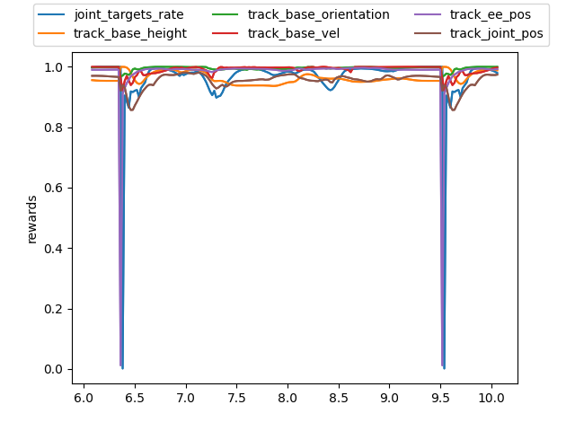
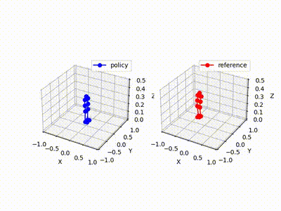
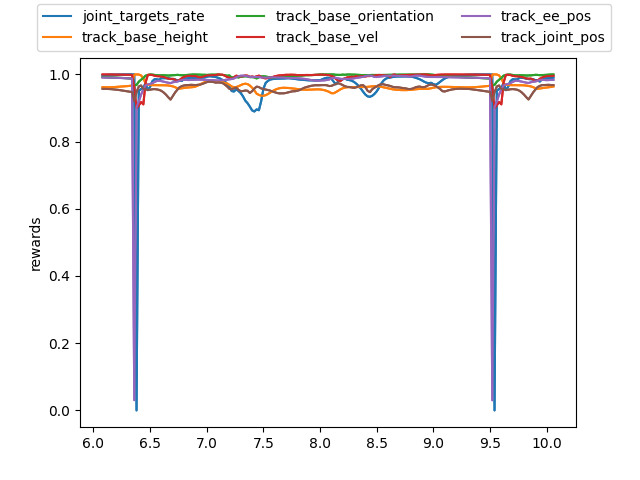
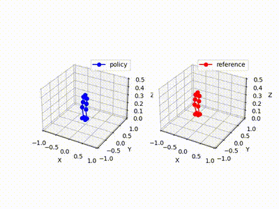
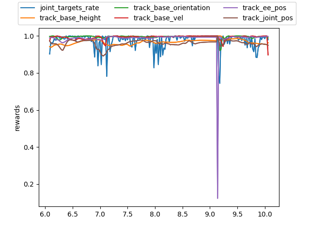

# Biped Motion Imitation with Deep Reinforcement Learning

Training a 12-DOF biped robot (MiniPi) to imitate reference walking motions using deep RL in Isaac Gym, with sim-to-sim transfer to MuJoCo.

<p align="center">
  
</p>

## Overview

This project implements a **DeepMimic**-style motion imitation pipeline for a small bipedal robot. A control policy is trained via **Proximal Policy Optimization (PPO)** to track a reference walking clip, then hardened with domain randomization so the learned behavior transfers across simulators.

<p align="center">
  
</p>

### Pipeline

| Stage | Description |
|-------|-------------|
| **1. Motion Imitation** | Multiplicative reward shaping (joint tracking, base height/orientation/velocity, end-effector position, action smoothness) drives the policy to replicate a reference walk cycle. |
| **2. Observation Redesign** | The policy is retrained using only onboard-available signals (projected gravity, angular velocity, joint states, action history) plus a 5-step observation history — removing privileged state like ground-truth yaw and linear velocity. |
| **3. Domain Randomization & Sim2Sim** | Friction, base mass, and random external pushes are varied during training. The final policy is evaluated in MuJoCo under perturbed physical parameters. |

## Results

### Stage 1 — Motion Imitation (Isaac Gym, full state)

<p align="center">
  
</p>

All reward terms converge close to 1.0, indicating accurate tracking of joint angles, base height, orientation, velocity, and end-effector positions.

<p align="center">
  
</p>

### Stage 2 — Onboard Observation Only

<p align="center">
  
</p>

Using only deployment-realistic observations (no ground-truth yaw or linear velocity), the policy retains high-quality imitation.

<p align="center">
  
</p>

### Stage 3 — Domain Randomization + Sim-to-Sim Transfer

<p align="center">
  
</p>

With domain randomization, the policy shows slightly noisier per-step rewards but maintains robust walking that transfers to MuJoCo.

<p align="center">
  
</p>

## Method Details

### Reward Design

Each reward term uses an exponential kernel on the L2 error, combined multiplicatively:

$$r = \prod_i \exp\!\Bigl(-\frac{\max(0,\,\|e_i\| - \tau_i)^2}{\sigma_i}\Bigr)$$

| Reward Term | Tracks |
|---|---|
| `track_base_height` | Reference CoM height |
| `track_joint_pos` | Reference joint angles |
| `track_base_orientation` | Reference base quaternion |
| `track_base_vel` | Reference base linear velocity |
| `track_ee_pos` | Reference end-effector (foot) positions |
| `joint_targets_rate` | Action smoothness (penalizes large changes) |

### Phase Variable

A `[0, 1]` phase signal indexes into the motion clip, providing the target reference frame at each timestep. The phase increments each step and wraps cyclically for continuous walking.

### Observation Space

**Deployment-ready observation** (Stage 2 & 3):

| Signal | Dim |
|---|---|
| Projected gravity | 3 |
| Base angular velocity | 3 |
| Joint angle offsets | 12 |
| Joint velocities | 12 |
| Previous action | 12 |
| Phase variable | 1 |
| Observation history (5 steps) | 5 x 43 |

### Domain Randomization (Stage 3)

| Parameter | Randomization |
|---|---|
| Friction coefficient | Uniform perturbation |
| Base mass | Additive offset |
| External pushes | Random velocity impulses at intervals |

## Project Structure

```
animRL/
├── cfg/mimic/           # Training configs (reward weights, DR params)
├── dataloader/          # Motion clip loader & phase utilities
├── envs/mimic/          # Isaac Gym environments
│   ├── mimic_task.py    # Full-state observation (Stage 1)
│   └── mimic_hw_task.py # Onboard observation (Stage 2 & 3)
├── rewards/             # Reward function implementations
├── scripts/
│   ├── train.py         # PPO training entry point
│   ├── eval.py          # Policy evaluation & video export
│   └── sim2sim.py       # MuJoCo sim-to-sim transfer
├── resources/
│   └── datasets/pi/     # Reference motion data (Walk.txt)
└── results/             # Trained models & evaluation artifacts
    ├── task-1/          # Stage 1 checkpoint + eval
    ├── task-2/          # Stage 2 checkpoint + eval
    └── task-3/          # Stage 3 checkpoint + eval
```

## Getting Started

### Prerequisites

- Python 3.8
- [Isaac Gym](https://developer.nvidia.com/isaac-gym) (requires NVIDIA GPU)
- [Poetry](https://python-poetry.org/) for dependency management

### Installation

```bash
poetry env use python3.8
poetry install
```

For GPU training inside Docker (with Isaac Gym pre-installed):

```bash
bash install.sh
```

### Training

```bash
# Stage 1 – motion imitation (full state)
python animRL/scripts/train.py --task=walk --dv

# Stage 2 – onboard observation
python animRL/scripts/train.py --task=walk-hw --dv

# Stage 3 – domain randomization (configure in walk_hw_config.py)
python animRL/scripts/train.py --task=walk-hw --dv
```

Add `--wb` to enable [Weights & Biases](https://wandb.ai) logging.

### Evaluation

```bash
# Evaluate in Isaac Gym
python animRL/scripts/eval.py --task=walk-hw --load_run=<run_id> --checkpoint=<iter>

# Sim-to-sim transfer (MuJoCo, runs locally without GPU)
python animRL/scripts/sim2sim.py --load_run=<run_name>
```

### Pre-trained Models

Pre-trained checkpoints for all three stages are available in `animRL/results/task-{1,2,3}/model.pt`.

## References

- Peng, Xue Bin, et al. *"DeepMimic: Example-Guided Deep Reinforcement Learning of Physics-Based Character Skills."* ACM Transactions on Graphics (TOG) 37.4 (2018): 1-14.
- Schulman, John, et al. *"Proximal Policy Optimization Algorithms."* arXiv preprint arXiv:1707.06347 (2017).

## License

This project is for educational and research purposes.
