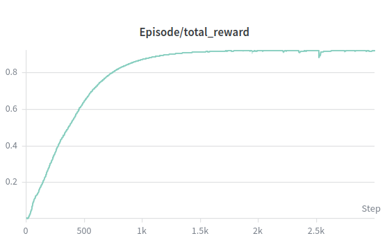

# Biped Motion Imitation with Deep Reinforcement Learning

Training a 12-DOF biped robot (MiniPi) to imitate reference walking motions using deep RL in Isaac Gym, with sim-to-sim transfer to MuJoCo.


## Overview

This project implements a **DeepMimic**-style motion imitation pipeline for a small bipedal robot. A control policy is trained via **Proximal Policy Optimization (PPO)** to track a reference walking clip, then hardened with domain randomization so the learned behavior transfers across simulators.


### Pipeline

| Stage | Description |
|-------|-------------|
| **Motion Imitation** | Multiplicative reward shaping (joint tracking, base height/orientation/velocity, end-effector position, action smoothness) drives the policy to replicate a reference walk cycle. |
| **Phase Variable** | A `[0, 1]` phase signal indexes into the motion clip, giving the policy a target frame at every timestep. |
| **Observation Redesign** | The policy is retrained using only onboard-available signals (projected gravity, angular velocity, joint states, action history) plus a 5-step observation history, removing privileged state like ground-truth yaw and linear velocity. |
| **Domain Randomization** | Friction, base mass, and random external pushes are varied during training to produce a robust policy that generalizes beyond the training simulator. |
| **Sim-to-Sim Transfer** | The final policy is evaluated in MuJoCo with multiple robot instances under perturbed physical parameters. |

### Key Results

The domain-randomized policy successfully transfers from Isaac Gym to MuJoCo, maintaining stable walking across varied physical conditions.



## Project Structure

```
animRL/
├── cfg/mimic/           # Training configs (reward weights, domain randomization params)
├── dataloader/          # Motion clip loader & phase utilities
├── envs/mimic/          # Isaac Gym environment (mimic_task.py, mimic_hw_task.py)
├── reward/              # Reward function implementations
├── scripts/
│   ├── train.py         # PPO training entry point
│   ├── eval.py          # Policy evaluation & video export
│   └── sim2sim.py       # MuJoCo sim-to-sim transfer
├── resources/
│   └── datasets/pi/     # Reference motion data
└── results/             # Trained models & evaluation artifacts
```

## Getting Started

### Prerequisites

- Python 3.8
- [Isaac Gym](https://developer.nvidia.com/isaac-gym) (requires NVIDIA GPU)
- [Poetry](https://python-poetry.org/) for dependency management

### Installation

```bash
poetry env use python3.8
poetry install
```

For GPU training inside Docker (with Isaac Gym pre-installed):

```bash
bash install.sh
```

### Training

```bash
# Stage 1 – basic motion imitation
python animRL/scripts/train.py --task=walk --dv

# Stage 2 – onboard-observation policy
python animRL/scripts/train.py --task=walk-hw --dv

# Stage 3 – with domain randomization (randomization set in config)
python animRL/scripts/train.py --task=walk-hw --dv
```

Add `--wb` to enable [Weights & Biases](https://wandb.ai) logging.

### Evaluation

```bash
# Evaluate in Isaac Gym
python animRL/scripts/eval.py --task=walk-hw --load_run=<run_id> --checkpoint=<iter>

# Sim-to-sim transfer (MuJoCo, runs locally)
python animRL/scripts/sim2sim.py --load_run=<run_name>
```

## Method Details

**Reward Design** — Each reward term uses an exponential kernel on the L2 error with per-term sigma and tolerance, combined multiplicatively:

$$r = \prod_i \exp\!\Bigl(-\frac{\max(0,\,\|e_i\| - \tau_i)^2}{\sigma_i}\Bigr)$$

**Observation (deployment-ready)** — projected gravity, angular velocity, joint angle offsets, joint velocities, previous action, phase variable, and a 5-step observation history.

**Domain Randomization** — friction coefficients, base mass offset, and random velocity impulses applied at configurable intervals.

## References

- Peng, Xue Bin, et al. *"DeepMimic: Example-Guided Deep Reinforcement Learning of Physics-Based Character Skills."* ACM Transactions on Graphics (TOG) 37.4 (2018): 1-14.
- Schulman, John, et al. *"Proximal Policy Optimization Algorithms."* arXiv preprint arXiv:1707.06347 (2017).

## License

This project is for educational and research purposes.
